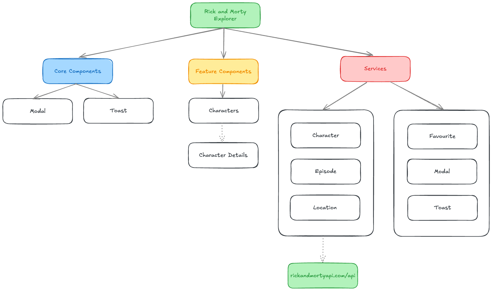

# Rick and Morty Explorer
A responsive Angular application that interacts with the [Rick and Morty API](https://rickandmortyapi.com/).

# Setup
```bash
npm install
```

```bash
npm start
```

# Test
To run all available tests:
```bash
npm run test
```

To run individual tests:
```bash
npx jest src/app/shared/services/toast.service.spec.ts
```

# Architecture
